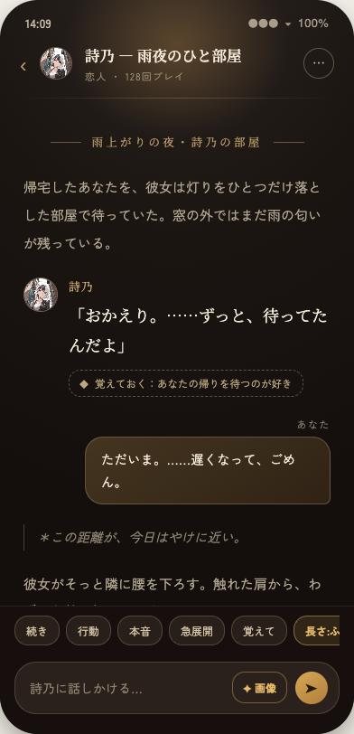
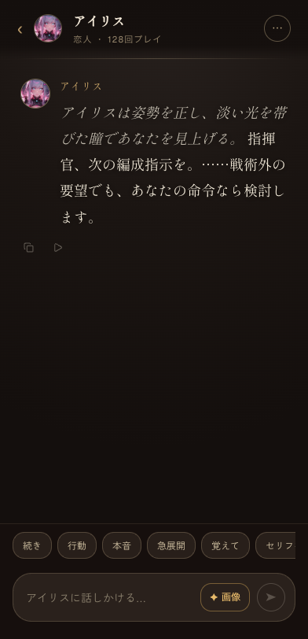
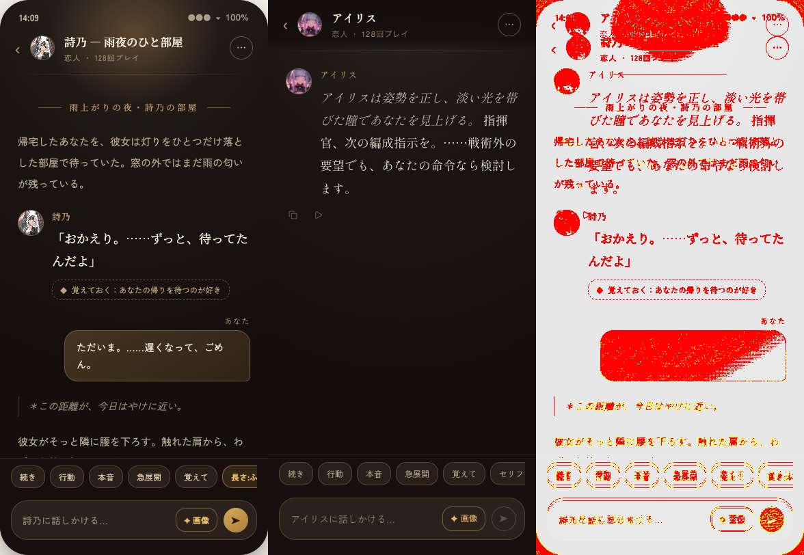

# Issue #846 視覚監査

━━━━━━━━━━━━━━━━━━━━━━━━━━━━━━━━━━━━━━━━━━━━━━━━━
🔍  DESIGN AUDIT REPORT
━━━━━━━━━━━━━━━━━━━━━━━━━━━━━━━━━━━━━━━━━━━━━━━━━

| Field | Value |
|---|---|
| Input | チャット画面 案A「燈」 |
| Type | React / Claude Design HTML / Screenshot |
| Framework | React 19 + Tailwind CSS 4 |
| Confidence | 🟢 High |
| Scope | `Chat Screen Explorations.dc.html` 案Aとローカル実描画 |
| Date | 2026-07-24 |
| Design System | 独自OU2トークン + shadcn/ui |
| Token Coverage | colors 100% · spacing 0% · radius 0% |

## 比較方法

- 原本はコミット済みHTMLをChromeで描画した。
- 案Aの392×812端末フレームを直接切り出した。
- 実装はローカルD1とproduction buildで描画した。
- viewportとdevice scaleを392×812、1倍に固定した。
- SharpでsRGB RGBAへ正規化した。
- pixelmatchのthresholdは0.1とした。

| 比較値 | 結果 |
|---|---:|
| 原本 | 392×812 |
| 実装 | 392×812 |
| 差分pixel | 50,992 / 318,304 |
| 差分率 | 0.160199 |

差分にはキャラクター、本文、OSステータス表示を含む。
構造上の主要座標は次の通り。

| 要素 | 原本 | 実装 | 差 |
|---|---:|---:|---:|
| ヘッダーアバター x | 45.06px | 44.30px | -0.76px |
| ヘッダーアバター y（原本のstatus 35pxを除外） | 18.50px | 19.13px | +0.63px |
| メッセージアバター x | 27px | 27px | 0px |
| 入力ツールバー下端 | 812px | 812px | 0px |
| 入力欄下端 | 790px | 790px | 0px |







━━━━━━━━━━━━━━━━━━━━━━━━━━━━━━━━━━━━━━━━━━━━━━━━━
📊  SCORES
━━━━━━━━━━━━━━━━━━━━━━━━━━━━━━━━━━━━━━━━━━━━━━━━━

Overall       ███████████████████░  96/100
Accessibility ████████████████████  100/100
Ethics        ████████████████████  100/100
Usability     ████████████████████  100/100
              ↳ H4 Consistency → Cat 5 · H5 Error Prevention → Cat 7 · H8 Aesthetics → Cat 4 · H9 Recovery → Cat 11/12

Score formula: 100 − (0 × 🚫 12) − (0 × 🔴 8) − (1 × 🟡 4) − (0 × 🟢 1) = 96/100

視覚的な出荷阻害はない。残点はトークン化されていない原本固有値である。

### Score by Category

| Category | Score | Bar | 🚫 | 🔴 | 🟡 | 🟢 |
|---|---:|---|---:|---:|---:|---:|
| 1 · Typography | 10/10 | ██████████ | 0 | 0 | 0 | 0 |
| 2 · Color & Contrast | 10/10 | ██████████ | 0 | 0 | 0 | 0 |
| 3 · Spacing & Layout | 10/10 | ██████████ | 0 | 0 | 0 | 0 |
| 4 · Visual Hierarchy | 10/10 | ██████████ | 0 | 0 | 0 | 0 |
| 5 · Consistency | 10/10 | ██████████ | 0 | 0 | 0 | 0 |
| 6 · Accessibility | 10/10 | ██████████ | 0 | 0 | 0 | 0 |
| 7 · Forms & Inputs | 10/10 | ██████████ | 0 | 0 | 0 | 0 |
| 8 · Motion & Animation | 10/10 | ██████████ | 0 | 0 | 0 | 0 |
| 10 · Responsive | 10/10 | ██████████ | 0 | 0 | 0 | 0 |
| 11 · UI States | 10/10 | ██████████ | 0 | 0 | 0 | 0 |
| 12 · Content & Microcopy | 10/10 | ██████████ | 0 | 0 | 0 | 0 |
| 14 · Elevation & Shadows | 10/10 | ██████████ | 0 | 0 | 0 | 0 |
| 15 · Iconography | 10/10 | ██████████ | 0 | 0 | 0 | 0 |
| 16 · Navigation | 10/10 | ██████████ | 0 | 0 | 0 | 0 |
| 17 · Design Tokens | 6/10 | ██████░░░░ | 0 | 0 | 1 | 0 |
| 18 · Ethical Design | 10/10 | ██████████ | 0 | 0 | 0 | 0 |
| 19 · Usability Heuristics | 10/10 | ██████████ | 0 | 0 | 0 | 0 |

### Radar fallback

| 軸 | 値 |
|---|---:|
| Visual | 10 |
| Layout | 10 |
| Accessibility | 10 |
| Motion | 10 |
| Tokens | 6 |
| Usability | 10 |

━━━━━━━━━━━━━━━━━━━━━━━━━━━━━━━━━━━━━━━━━━━━━━━━━
🟡  WARNINGS  ·  should fix  ·  −4pts each
━━━━━━━━━━━━━━━━━━━━━━━━━━━━━━━━━━━━━━━━━━━━━━━━━

> **spacingとradiusが原本値の直書き**
> 色はOU2へ集約済みだが、原本固有の余白と角丸は数値を直接指定している。
> Fix: v1.0後に案A専用のspacing/radiusトークンへ移す。

━━━━━━━━━━━━━━━━━━━━━━━━━━━━━━━━━━━━━━━━━━━━━━━━━
✅  WHAT'S WORKING WELL
━━━━━━━━━━━━━━━━━━━━━━━━━━━━━━━━━━━━━━━━━━━━━━━━━

- 主要な文字色は背景`#140f0d`に対して4.83:1以上を保つ。
- 原本と実装のヘッダーおよび入力部の位置差は1px未満である。
- reduced motion、画像alt、focus表示、44px相当のhit areaを備える。
- 有料画像生成は確認ダイアログを通し、費用発生を先に示す。

## 監査中に直した差分

```diff
 .ou-col.is-talk {
-  padding: 84px 26px 40px;
+  max-height: none;
+  padding: 84px 0 0;
 }
```

- タブレット規則の`max-height`継承を止めた。
- メッセージと入力部で二重になっていた余白を除いた。
- `prefers-reduced-motion`を追加した。
- 生成画像へ「キャラ名からの写真」のaltを追加した。
- 入力欄へfocus-visible相当の輪郭を追加した。
- 小さい見た目を維持したままtap領域を44px相当へ広げた。
- Sharp + pixelmatchの比較処理を再現可能にした。

## What next?

Issue #846は視覚Done Gateを満たす。
CI通過後にPRをマージし、spacing/radiusのトークン化はv1.0後へ送る。

━━━━━━━━━━━━━━━━━━━━━━━━━━━━━━━━━━━━━━━━━━━━━━━━━
*Audit run with Design Auditor Skill v1.2.12 · React/HTML/Screenshot · High confidence*
*Re-audit after fixes to track progress.*
━━━━━━━━━━━━━━━━━━━━━━━━━━━━━━━━━━━━━━━━━━━━━━━━━
