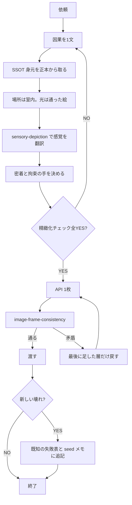

# 画像プロンプト SSOT と精緻化

画像モデルへ投げる直前にこのファイルを読む。パイプライン工程（R2/D1）は `image-generation-pipeline`。五感の密度は `sensory-depiction`。出力の矛盾チェックは `image-frame-consistency`。

## 思考（本質）

タグを並べる前に、画面の因果を一文で書く。書けんならプロンプトが足りてへん。

```
誰が / どこで / 何時の光で / 何をして / 手が何を掴み / 体液は重力でどこへ落ちる
```

この文がプロンプトの層と 1:1 で対応すること。対応せん層は消すか足す。

## SSOT（二重に盛るな）

| 層 | 正本 | プロンプトでの扱い |
|---|---|---|
| 身元（顔・髪・目・花飾り・バスト） | D1 `lora_model` + `lora_trigger_prompt`。LoRA 無しなら `image_meta.appearance` | trigger ＋短い身元タグのみ。identity-prompt-builder の重み付きブロックと二重にしない |
| モデル | キャラLoRA推論は Runware `aiadultapp:waiillustrious@9`。レシピは 10点 seed | ここを毎回再発明しない |
| シーン（行為・拘束・表情） | 今回の依頼文 | 可変層。体位ごとに「最大密着」と「拘束の手」を先に決めてからタグ化 |
| 場所・光・空気 | 室内ベッドは抜くな。光は**そのキャラで最初に通った絵**が正本 | 未検証の夜ランプを足すな。さくらは昼窓の絵が勝った |

Sakura LoRA の確定値: `aiadultapp:sakurakoharu@1` weight 0.85、trigger `sakurakoharu`、身元短タグ `long wavy honey-blonde hair, blue eyes, flower hair ornament, medium breasts`。

## 精緻化チェック（投げる前）

全部 YES になるまで API を叩くな。

- [ ] 正プロンプトはおおよそ 650 字以内。超えたら足さず削る
- [ ] negative がある（落とすな。後期悪化の直接因）
- [ ] 場所（部屋/壁/床）がある。光は通った絵に合わせている
- [ ] 男の顔: 出すなら構図で顔が映る。出さないなら**男の背中側**にカメラを置く。`no male face` の連打はするな
- [ ] 顔と結合を同時に見せるなら横 1216×832。縦 832×1216 で両方要求するな
- [ ] 拘束があるなら、どの手が何を掴むか書いてある
- [ ] 密着があるなら、体のどの面が接するか書いてある
- [ ] 五感は `sensory-depiction` の密度（通常1-2 / エロ3-4）で、見える結果に落ちている
- [ ] negative に下表の既知失敗が入っている

## 既知の失敗（タグの副作用）

正本。新しい壊れを目視したら**この表に追記**し、`.work/seeds/images/YYYYMMDD-*.md` にも証拠パスを残す。チャットだけに書くな。

| タグ/指定 | 壊れ | 測った絵 |
|---|---|---|
| 指示を全部正に足す（正が 800 字超、negative 欠落） | やればやるほど悪くなる | `ae`〜`ah` vs `g` |
| `impregnation` | 卵子図解 | `b-hold-creampie` |
| `full body` + 行為、または縦絵で顔+結合を同時指定 | 漫画コマ割り | `bc-press-gplus` |
| `uncensored` / `explicit` / `detailed pussy` | モザイク | `ag-ekiben-explicit` |
| `camera from …`（camera を名詞で置く） | 画面にカメラ・三脚 | `ae` `ag` `ah` |
| 男の顔を出せ | 恋愛画に逃げる | 初期の顔出しバッチ |
| `no male face` を正負に連打 | 無視される。横構図だと横顔が残る | `be` `bf` `bg` |
| 未検証の夜ランプ | 昼窓に負ける | `ba` `bb` vs `g` |
| `standing` + `lifting` / `carrying` だけ | 屋外城・服・モザイク | `bk-ekiben` |
| 座位 over-shoulder | 結合が体に隠れる。i2i 0.55 でも出ない | `cf` `ch` |
| 駅弁プロンプトに bed を入れる | 寝プレスに落ちる。壁＋床に足をつけない、で持ち上がった | `cl` vs `cn` |
| 身元を重み付きで二重 | 盛って崩れる | — |
| `his head out of frame` / crop-head | 立ちバック横構図では効く。種付けプレス・座位では無視される | `ck` vs `cm` `cs` `ct` |

密着押し潰しと結合の同時可視化はトレードオフ。背中側カメラは顔が消えて結合が隠れ（`bh`）、横構図は結合が見えて男顔が残る（`bf`）。両方同時はまだ通ってない。

## 1枚見てから1層だけ直す

API のあと必ず目視。FAIL なら**最後に足した層だけ**戻す。新しい依頼を全部正に積むな。



3 分岐以上ある工程は、チャット説明ではなくこの図か同等の mermaid を残す。証拠の置き場は `.work/seeds/images/`。調査メモは `.dbg/`。
