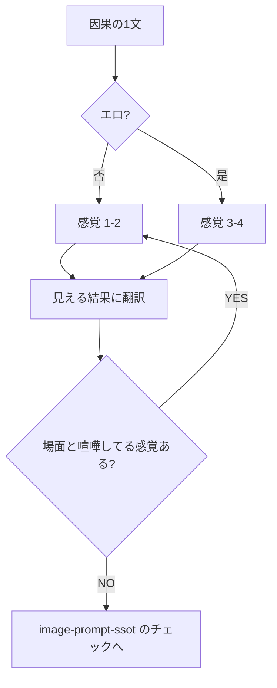

# 五感描写

プロンプトを投げる前、または会話文を書く前に読む。組み立て全体は `image-prompt-ssot`。画面の矛盾は `image-frame-consistency`。チャット採点の「showing / 五感不足」は `prompt/instructions/prohibitions.md` の減点軸4。ここはその入れ方。

## 密度

| 文脈 | 入れる数 | 目安 |
|---|---|---|
| 通常（肖像・日常） | 1〜2 | 光と肌、または空気の温度。全部盛りは禁止 |
| エロ | 3〜4 | 熱・湿り・接触音に相当する視覚、汗のだれ、震え。通常より厚くてよい |

5つ並べたら違和感。シーンの因果に効く感覚だけ取る。

## 画像への翻訳

画像モデルは匂いも音も描かん。感覚は **見える結果** に落とす。

| 感覚 | 通常 | エロで足してよい |
|---|---|---|
| 視 | 光源、肌のハイライト | 濡れ光沢、紅潮、涙の筋 |
| 触 | 布の皺、体重の潰れ | 密着で隙間なし、拘束の指、痙攣、ピクピク |
| 聴 | 使わんか、口の開きだけ | 喘ぎ口、歯を食いしばる、拍動は motion lines |
| 嗅 | 使わん | 汗の滴、体が濡れてる。花の香りをレイプに足すな |
| 味 | 使わん | 唾、唇の光。説明タグ `taste of` は入れるな |

## 禁止

- 因果に無い感覚を足す（密室の汗なのに桜の香り）
- `impregnation` で卵子図を出す（五感の代わりにならない）
- エロだからと5感覚を全部タグ化する

## フロー

